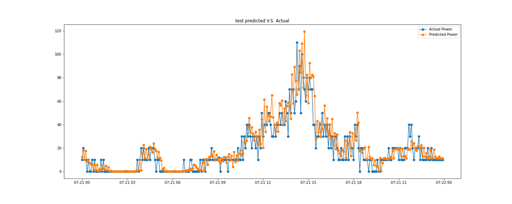

# Wind Power Prediction
該報告為我在 2022/07~2022/08 碩一生碩二暑假在台泥資訊實習之成果報告，利用內部在彰濱工業區六支風力發電機的資料，目標是想要預測每日風力發電量，比便後續集團在電力調度上做支援。六支風機並不是相同的型號，而是由兩個廠商所製造。每支風機都設置相同的sensor，每五分鐘就會回傳一次到資料庫。模型採用 Ensemble Learning，weak predicter 由 XGBoost 和 SVM 所組成。最終預測其實並沒有很準確，特別是在於風力有比較大的變化時，會有落後的現象，推測是因為手中的資料主要是時間落後的資料，沒有納入天氣預報等，若可以引入該類型資料的話，將有助於模型。
